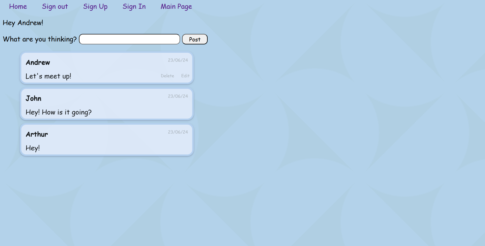

# Messaging Board App
Messaging Board app is a web application designed for users to interact with each other through instant messaging.

[Click here to use this app](https://main--messaging-board-project.netlify.app/)

## Technologies Used
- **Javascript**: Back-end structure

- **CSS**: Styling 

- **Embedded Javascript**: Client interface - front-end structure

- **MongoDB**: Manage database

## Demo

Landing page


Sign-up page


Sign-in page


Main page


Message board





## Relevant Code

### Javascript

Auth Controllers

```js
const express = require("express");
const router = express.Router();
const User = require("../models/user.js");
const bcrypt = require("bcrypt");

// GET sign-in
router.get('/sign-in', (req, res) => {
  res.render('auth/sign-in.ejs');
});

// GET sign-up
router.get('/sign-up', (req, res) => {
  res.render('auth/sign-up.ejs');
});

// POST sign-up
router.post('/sign-up', async (req, res) => {
  const { username } = req.body;
  const { password } = req.body;
  const userInDatabase = await User.findOne({ username: req.body.username });
  try {
    if (username.length > 10) {
      return res.send('Username must be 10 characters or less.');
    }

    if (password.length > 8) {
      return res.send('Username must be 8 characters or less.');
    }

    if (userInDatabase) {
      return res.send('Username already taken.');
    }

    if (req.body.password !== req.body.confirmPassword) {
      return res.send("Passwords don't match.")
    }

    if (!req.body.password || !req.body.confirmPassword) {
      return res.send('Please fill in the required fields.');
    }

    const hash = bcrypt.hashSync(req.body.password, 10);
    req.body.password = hash;

    const user = await User.create(req.body);
    res.redirect("/auth/sign-in")
  } catch (err) {
    return res.send('Please fill in the required fields.');
  }
});

// POST sign-in
router.post('/sign-in', async (req, res) => {
  try {
    const userFromDatabase = await User.findOne({
      username: req.body.username,
    });

    const passwordsMatch = await bcrypt.compare(
      req.body.password,
      userFromDatabase.password
    );

    req.session.user = {
      username: userFromDatabase.username,
      userId: userFromDatabase._id,
    };

    if (passwordsMatch) {
      res.redirect("/messages/main");
    } else {
      return res.send("Passwords don't match.");
    }
  } catch (err) {
    return res.send('Login Failed.');
  }
});

// GET sign-out
router.get("/sign-out", (req, res) => {
  req.session.destroy();
  res.redirect("/");
})

module.exports = router;

```

CRUD Controllers

```js
const express = require("express");
const router = express.Router();
const Message = require("../models/message.js");
const moment = require("moment")

// Routs (endpoints):
//GET main page
router.get("/main", async (req, res) => {
    //try {
    const messages = await Message.find().populate('createdBy')
    const userSession = req.session.user
    //const userId = await Message.find(req.session.user.userId);
    res.render('../views/main.ejs', {
        messages: messages, // pass through the messages to ejs template.
        userSession: userSession,
        moment: moment
    })
    //} catch (){

    //}
})

//POST message
router.post('/main', async (req, res) => {
    const { content } = req.body;
    if (content.length <= 30) {
        try {
            // Create the message using mongoose.
            req.body.createdBy = req.session.user.userId
            const message = await Message.create(req.body)

            // Send back the new message to the user.
            res.redirect('/messages/main')
        } catch (err) {
            if (err.name === 'ValidationError') {
                res.redirect('/messages/main')
            }
        }
    } else {
        let errorMsg = 'Comment must be 30 characters or less.';
        return res.send(errorMsg);
    }
})

// DELETE message
router.delete('/main/:id', async (req, res) => {
    const deletedmessage = await Message.findByIdAndDelete(req.params.id);
    res.redirect('/messages/main')
})

// EDIT message
router.get('/edit/:id', async (req, res) => {
    const id = req.params.id
    const messageToUpdate = await Message.findById(id)

    res.render('../views/edit.ejs', {
        messageToUpdate: messageToUpdate
    })
})

router.put('/edit/:id', async (req, res) => {
    const messageUpdate = await Message.findByIdAndUpdate(req.params.id, req.body, { new: true });
    res.redirect('/messages/main')
})


module.exports = router;
```

Server

```js

// Adds environment variables from .env into process.env (node environment)
require('dotenv').config();

const authController = require('./controllers/auth.js');
const messagesController = require('./controllers/messages.js');

// Require express framework -> Provides broad features for building web and mobile applications
const express = require('express');
const app = express();

// Allows us to have PUT and DELETE requests made from html forms
const methodOverride = require('method-override');
app.use(methodOverride('_method'));

// Allow loggin in
const morgan = require('morgan');

//  Allows the creation and storage of the session data used for authentication or user preferences
const session = require('express-session');

// Built-in module that provides utilities for working with file and directory paths
const path = require("path");

// Library to hash a password
const bcrypt = require("bcrypt");

// Connection to mongoose database
const mongoose = require('mongoose');
mongoose.connect(process.env.MONGODB_URI);

// Allows request.body object to be read in the handlers
app.use(express.json());

// Tell express to expect data from our form -> Remove data from url and put into request body
app.use(express.urlencoded({ extended: false }));

// Adding css
app.use(express.static(path.join(__dirname, "public")));

// Creating a session (cookie) for authentication and authorization
// Every request from a client will create a session and attatch it to HTTP headers
// These cookies are only alive when the server is running
// These cookies exist regardless of the user being signed in
app.use(
    session({
      secret: process.env.SECRET_PASSWORD, // Replace with a strong secret key
      resave: false, // Forces the session to be saved back to the store, even if it wasn't modified
      saveUninitialized: true, // Forces a session that is "uninitialized" to be saved to the store
      cookie: { secure: false }, // Secure should be true in production if you're using HTTPS
    })
);

// Enables function globally in the browser
app.use(function (req, res, next) {
    res.locals.user = req.session.user;
    next();
});

// Accessing the controllers to enable HTTP requests (get, post, put and delete)
app.use('/auth', authController);
app.use('/messages', messagesController);

// Landing page
app.get('/', (req, res) => {
    res.render('home.ejs', {
      user: req.session.user,
    });
});

// If the port doesn't exist, define it as 3000
const port = process.env.PORT ? process.env.PORT : 3000;

// Keeps the connection open for requests
app.listen(port, () => {
  console.log("Listening on port ", process.env.PORT);
});
```

### Embedded Javascript

Sign-in

```HTML
<!DOCTYPE html>
<html lang="en">
  <head>
    <meta charset="UTF-8" />
    <meta name="viewport" content="width=device-width, initial-scale=1.0" />
    <title>Sign In</title>
    <link rel="stylesheet" href="/stylesheets/main.css">
  </head>
  <body>
    <%- include('../partials/nav') %>
    <h1>Sign in</h1>
    <form action="/auth/sign-in" method="POST">
      <label for="username">Username:</label>
      <input type="text" name="username" id="username" />
      <label for="password">Password:</label>
      <input type="password" name="password" id="password" />
      <button type="submit">Sign in</button>
    </form>
  </body>
</html>

```

Sign-up

```HTML
<!DOCTYPE html>
<html lang="en">
  <head>
    <meta charset="UTF-8" />
    <meta name="viewport" content="width=device-width, initial-scale=1.0" />
    <title>Sign Up</title>
    <link rel="stylesheet" href="/stylesheets/main.css">
  </head>
  <body>
    <%- include('../partials/nav') %>
    <h1>Create a new account</h1>
    <form action="/auth/sign-up" method="POST">
      <label for="username">Username:</label>
      <input type="text" name="username" id="username" />
      <label for="password">Password:</label>
      <input type="password" name="password" id="password" />
      <label for="confirmPassword">Confirm Password:</label>
      <input type="password" name="confirmPassword" id="confirmPassword" />
      <button type="submit">Sign up</button>
    </form>
  </body>
</html>

```

Edit

```HTML
<!DOCTYPE html>
<html lang="en">
<head>
    <meta charset="UTF-8">
    <meta name="viewport" content="width=device-width, initial-scale=1.0">
    <title>Document</title>
</head>
<body>
    <form action="/messages/edit/<%=messageToUpdate._id %>?_method=PUT" method="POST">
        <label for="content">Edit your message:</label>
        <input type="text" name="content" id="content">

        <button type="submit">Update</button>
    </form>
</body>
</html>
```

Home

```HTML
<!DOCTYPE html>
<html lang="en">
  <head>
    <meta charset="UTF-8" />
    <meta name="viewport" content="width=device-width, initial-scale=1.0" />
    <title>Document</title>
    <link rel="stylesheet" href="/stylesheets/main.css" />
  </head>
  <body>
    <h1 id="header1">The Network App</h1>
    <p id="links">
        <a id="a6" href="/auth/sign-up">Sign up</a> or
        <a id="a7" href="/auth/sign-in">Sign in</a>
        <br>
        <br>
        <a id="a8" href="/messages/main">Main Page</a>
    </p>
  </body>
</html>

```

Main

```HTML
<!DOCTYPE html>
<html lang="en">

<head>
    <meta charset="UTF-8">
    <meta name="viewport" content="width=device-width, initial-scale=1.0">
    <title>Document</title>
    <link rel="stylesheet" href="/stylesheets/main.css">
</head>

<body>
    <%- include('./partials/nav') %>
        <% if (userSession) { %>
            <p>Hey <%= user.username %>!</p>
            <form action="/messages/main" method="POST">
                <label for="content">What are you thinking?</label>
                <input type="text" name="content" id="content">
                <button type="submit" id="postbutton" role="button">Post</button>
            </form>
            <div id="messages">
                <ul>
                    <% messages.reverse().forEach((message,index)=> { %>
                        <% if(index < 20) { %>
                            <li>
                                <div id="divcontent">
                                    <p class="paragraph" id="postusername"><b>
                                            <%= message.createdBy.username %>
                                        </b></p>
                                    <p class="paragraph" id="message">
                                        <%= message.content %>
                                    </p>
                                </div>
                                <div id="buttonsdiv">
                                    <p id="date">
                                        <%= moment(message.createdAt).format("D/MM/YY") %>
                                    </p>
                                    <p id="buttons">
                                        <% if (message.createdBy._id.toString()===userSession.userId) { %>
                                            <form action="/messages/main/<%= message._id %>?_method=DELETE"
                                                method="POST" style="display:inline;">
                                                <button type="submit" id="deletebutton">Delete</button>
                                                <button id="editbutton"><a id="editbuttonanchor"
                                                        href="/messages/edit/<%= message._id %>">Edit</a></button>
                                            </form>
                                            <% } %>
                                    </p>
                                </div>
                            </li>
                            <% } %>
                                <% }) %>
                </ul>
            </div>
            <% } else {%>
                <div id="messages">
                    <ul>
                        <% messages.reverse().forEach((message,index)=> { %>
                            <% if(index < 20) { %>
                                <li>
                                    <div id="divcontent">
                                        <p class="paragraph" id="postusername"><b>
                                                <%= message.createdBy.username %>
                                            </b></p>
                                        <p class="paragraph" id="message">
                                            <%= message.content %>
                                        </p>
                                    </div>
                                    <div id="buttonsdiv">
                                        <p id="date">
                                            <%= moment(message.createdAt).format("D/MM/YY") %>
                                        </p>
                                    </div>
                                </li>
                                <% } %>
                                    <% }) %>
                    </ul>
                </div>
                <% } %>
</body>

</html>
```

### CSS

```CSS
html {
    --s: 211px; /* control the size*/
    --c1: #b0cfe3;
    --c2: #b3d2ea;
    
    background:
      radial-gradient(36% 72% at 25% -50%,var(--c2) 98%,#0000)
       0 0/calc(2*var(--s)) var(--s),
      radial-gradient(36% 72% at 75% 150%,var(--c2) 98%,#0000)
       0 0/calc(2*var(--s)) var(--s),
      radial-gradient(72% 36% at 150% 25%,var(--c2) 98%,#0000)
       0 0/var(--s) calc(2*var(--s)),
      radial-gradient(72% 36% at -50% 75%,var(--c2) 98%,#0000)
       0 0/var(--s) calc(2*var(--s)),
      repeating-conic-gradient(var(--c2) 0 45deg,var(--c1) 0 25%)
       0 0/calc(2*var(--s)) calc(2*var(--s));
  
    font-family: "Comic Sans MS", "Comic Sans", cursive;
}

#header1{
    text-align: center;
}

#links{
    text-align: center;
}

#a1, #a2, #a3, #a4, #a5, #a6, #a7, #a8{
    margin: 15px;
    text-decoration: none;
}

/*-------------------------------------------------------------*/

#content {
    height: 20px;
    width: 230px;
}

#postbutton{
    height: 25px;
    width: 60px;
}

#content, #postbutton {
    border-radius: 9px;
    border-width: 1.5px;
    font-family: "Comic Sans MS", "Comic Sans", cursive;
}

/*-------------------------------------------------------------*/

#editbuttonanchor {
    text-decoration: none;
    color: rgb(175, 182, 190);
}

#editbutton{  
    font-family: "Comic Sans MS", "Comic Sans", cursive;
    border: transparent;
    background-color: transparent;
    font-size: 10px;
}

#editbutton:hover{
    text-decoration: underline;
    cursor: pointer;
}

#deletebutton{
    border: transparent;
    background-color: transparent;
    font-size: 10px;
    color: rgb(175, 182, 190);
    font-family: "Comic Sans MS", "Comic Sans", cursive;
}

#deletebutton:hover{
    text-decoration: underline;
    cursor: pointer;
}


/*-------------------------------------------------------------*/

ul {
    list-style-type: none;
}
  
li {
    display: flex;
    justify-content: space-between;
    flex-direction: row;
    opacity: 0.9;
    border-radius: 15px;
    border: solid rgb(180, 208,240) 4px;
    margin-bottom: 7px;
    background-color: rgb(224, 234, 249);
    height:110px;
    max-height: 70px;
    width: 400px;
    box-shadow: rgba(50, 50, 93, 0.25) 0px 2px 5px -1px, rgba(0, 0, 0, 0.3) 0px 1px 3px -1px;
}

#buttonsdiv{
    flex-direction: column;
}

.paragraph{
    margin:10px;
}

#date{
    display:flex;
    justify-content: flex-end;
    border: transparent;
    background-color: transparent;
    font-size: 10px;
    color: rgb(175, 182, 190);
    font-family: "Comic Sans MS", "Comic Sans", cursive;
    margin-right: 10px;
}
/*-------------------------------------------------------------*/

#messages2{
    width: 450px;
}

#message2{
    margin-bottom: 0px;
    margin-left:10px;
}

#postusername2{
    margin-top:5px;
    margin-bottom: 0px;
    margin-left:10px;
}

#date2{
    color: rgb(175, 182, 190);
    font-size: 10px;
}

#postusername2, #date2{
    display: inline;
}
```

## Stretch Goals

- Message reaction feature
- Option to upload images to massages

## Attributions

Background: https://css-pattern.com/half-circles/